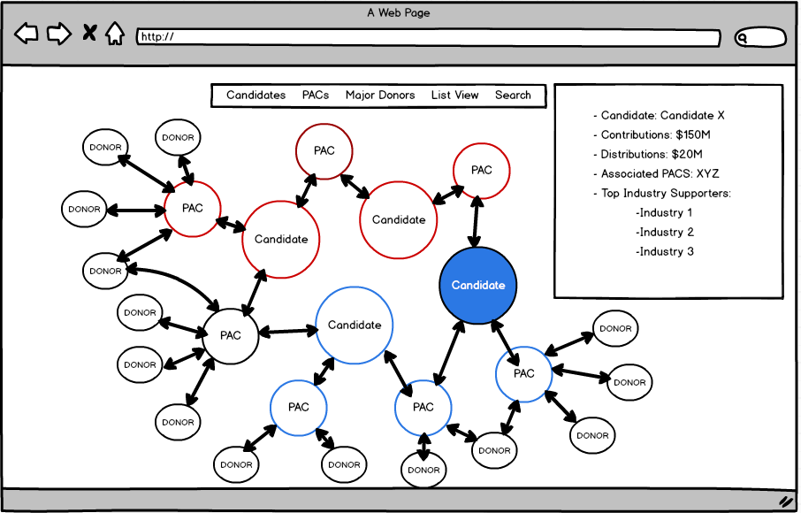

# Campaign Finance Explorer App
##Overview
I want to create a Campaign Finance data visualization projects to explore some of the largest donors to political campaigns.  My project will focus specifically on the largest SuperPACs involved in the current presidential campaign to reduce the scope of the exploration.  I will be integrating with publicly available FEC apis (also a few New York Times APIs) that show all information on political donations. At a very minimum I would like to create a network-style data visualization that will show the flow of funds from donor to pac to candidate. If I have time I would also like to show detail on each node.

##Technologies I Will Use
- HTML/CSS/JS: For overall app content and structure
- D3.js: Will use the Force diagram and Tree layouts to display the flow of funds
- JQuery: I will use JQuery for detail boxes that will attach to each Node
- AJAX & LocalStorage: I'm going to be loading all data at once due to the high number of api calls required and I will need to persist this data throughout the app.

##Features in Order of Importance
1. Data Object that will hold all of the data from the APIs & be structures in a way that D3 can use
2. A D3 force diagram displaying the tree structure of all of participants' connections
3. Varying weight and colors of each Node & Link based on party affiliation and capital base
4. A popup that aggregates major donor info for each PAC & Candidate upon click
5. Search functionality that will immediately highlight a Candidate, Donor, or PAC
6. The ability to Filter based on party, size, and Candidate
7. A seperate tree diagram for each node that will display an in depth view of donations based on size & industry
8. The ability to add or remove PACs while zooming & panning the screen to include all new elements

##Pivotal Tracker:
https://www.pivotaltracker.com/n/projects/1524201

